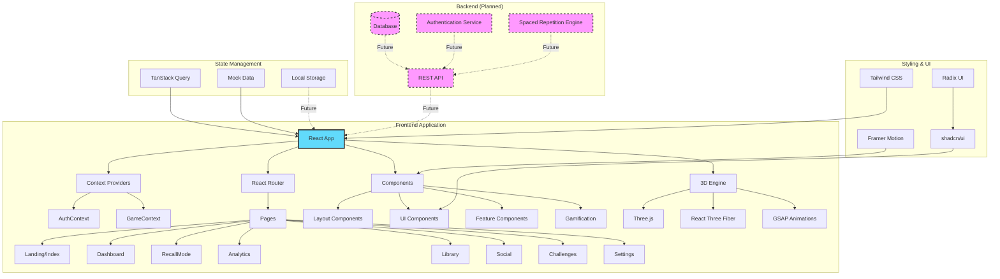
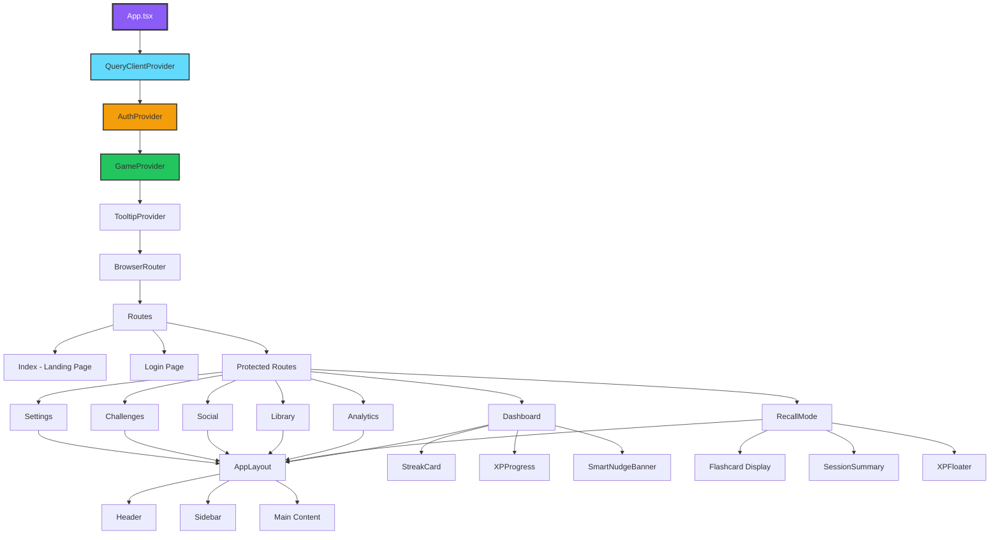
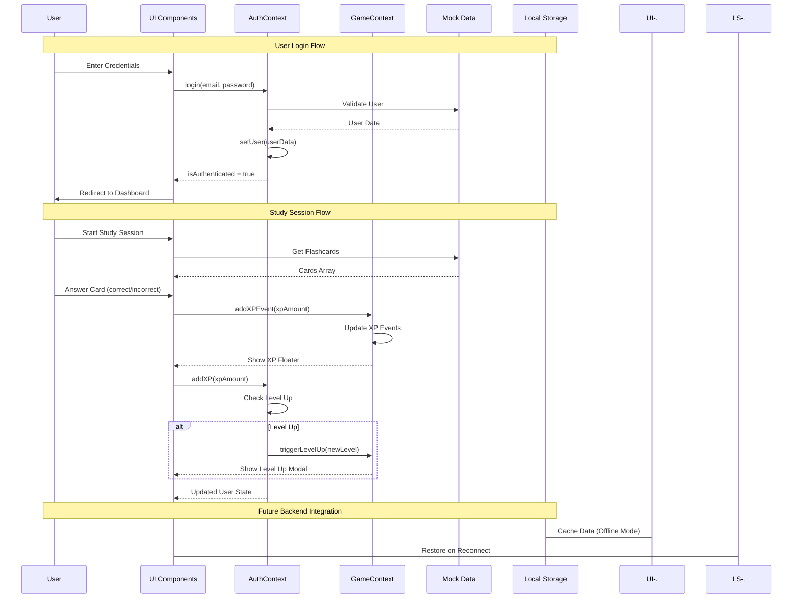
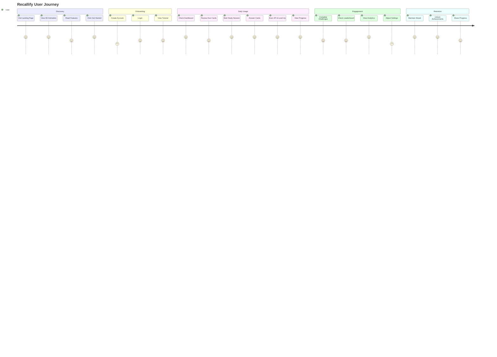
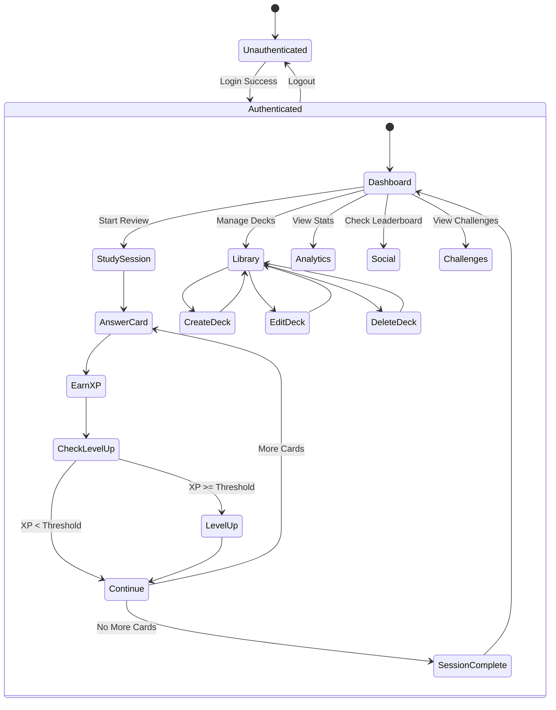
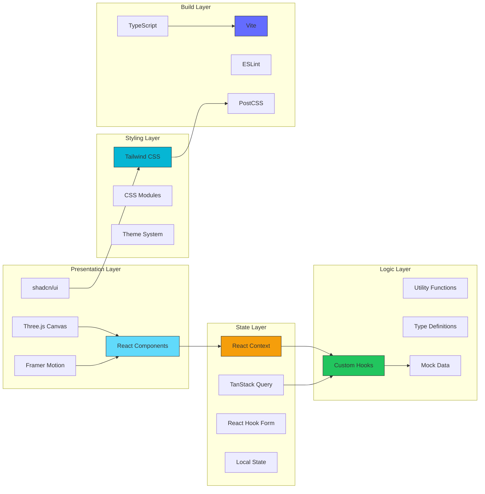

<div align="center">
  
  # 🧠 Recallify
  
  ### *Train Your Memory. Level Up Your Learning.*
  
  <p align="center">
    
    
    
    
    
  </p>

  <p align="center">
    <strong>Scientifically proven spaced repetition meets gamified learning. Watch your recall skyrocket with Recallify.</strong>
  </p>

  <p align="center">
    <a href="#-features">Features</a> •
    <a href="#-demo">Demo</a> •
    <a href="#-tech-stack">Tech Stack</a> •
    <a href="#-getting-started">Getting Started</a> •
    <a href="#-project-structure">Structure</a> •
    <a href="#-roadmap">Roadmap</a>
  </p>

</div>

---

## ✨ Features

### 🎮 Gamification Engine
- **XP & Leveling System** - Earn experience points for every correct answer
- **Streak Tracking** - Build daily streaks to stay motivated
- **Achievement System** - Unlock badges and rewards for milestones
- **Level-Up Celebrations** - Animated modals celebrating your progress
- **XP Floaters** - Real-time visual feedback for earned XP

### 🧠 Advanced Learning System
- **Spaced Repetition Algorithm** - Science-backed review scheduling
- **Adaptive Difficulty** - Cards adjust based on your performance
- **Recall Strength Tracking** - Monitor memory retention per card
- **Smart Study Sessions** - AI-optimized review recommendations
- **Multi-Deck Management** - Organize cards by subject or category

### 📊 Analytics & Insights
- **Performance Dashboard** - Visualize your learning progress
- **Retention Analytics** - Track recall rates over time
- **Study Heatmaps** - See your most productive study patterns
- **Cognitive Load Monitor** - Prevent mental fatigue with smart pacing
- **AI-Powered Insights** - Get personalized study recommendations

### 🎨 Beautiful UI/UX
- **3D Interactive Hero** - Immersive Three.js landing page
- **Glassmorphism Design** - Modern, elegant UI components
- **Smooth Animations** - Framer Motion powered transitions
- **Dark Mode Ready** - Built-in theme support
- **Responsive Design** - Seamless experience across all devices

### 🏆 Social Features
- **Leaderboards** - Compete with friends and the community
- **Ghost Competitors** - Race against AI-powered study partners
- **Challenge System** - Daily, weekly, and special challenges
- **Social Proof** - See what others are mastering
- **Community Stats** - Compare your progress with global averages

---

## 🎯 Demo

### Landing Page
Beautiful 3D interactive hero with glowing particles and ethereal animations

### Dashboard
![Dashboard Features]
- Quick stats overview with streak, retention, and cognitive load
- Smart nudge banner for optimal study timing
- Deck mastery progress with visual indicators
- Active challenges and AI insights

### Recall Mode
Interactive flashcard interface with:
- Real-time XP tracking
- Streak counter
- Confidence-based difficulty adjustment
- Session summary with detailed analytics

---

## 🛠️ Tech Stack

### Frontend Core
- **React 18.3** - UI library with concurrent features
- **TypeScript 5.8** - Type-safe development
- **Vite 5.4** - Lightning-fast build tool
- **React Router 6** - Client-side routing

### Styling & Design
- **Tailwind CSS 3.4** - Utility-first styling
- **shadcn/ui** - High-quality component library
- **Framer Motion 10** - Production-ready animations
- **Radix UI** - Accessible component primitives

### 3D & Animations
- **Three.js 0.160** - 3D graphics library
- **React Three Fiber** - React renderer for Three.js
- **React Three Drei** - Useful helpers for R3F
- **GSAP 3.14** - Professional-grade animation

### State & Data
- **TanStack Query** - Server state management
- **Context API** - Global app state (Auth, Game)
- **React Hook Form** - Form state management
- **Zod** - Schema validation

### UI Enhancements
- **Recharts** - Data visualization
- **Lucide React** - Beautiful icon library
- **Sonner** - Toast notifications
- **date-fns** - Date manipulation

---

## 🚀 Getting Started

### Prerequisites
- **Node.js** 18.x or higher
- **npm** or **bun** package manager

### Installation

```bash
# Clone the repository
git clone <your-repo-url>
cd memory-master

# Install dependencies
npm install
# or
bun install

# Start development server
npm run dev
# or
bun dev
```

The app will be available at `http://localhost:5173`

### Build for Production

```bash
# Create optimized build
npm run build

# Preview production build
npm run preview
```

### Linting

```bash
# Run ESLint
npm run lint
```

---

## 📁 Project Structure

```
memory-master/
├── public/                  # Static assets
│   └── robots.txt          # SEO configuration
├── src/
│   ├── components/         # React components
│   │   ├── brand/         # Logo and branding
│   │   ├── features/      # Feature showcases
│   │   ├── gamification/  # XP, streaks, level-ups
│   │   ├── layout/        # App shell components
│   │   ├── recall/        # Flashcard session UI
│   │   ├── social/        # Community features
│   │   └── ui/            # shadcn/ui components
│   ├── contexts/          # React Context providers
│   │   ├── AuthContext.tsx    # User authentication
│   │   └── GameContext.tsx    # Gamification state
│   ├── data/              # Mock data & types
│   │   └── mockData.ts    # Sample decks & cards
│   ├── hooks/             # Custom React hooks
│   ├── lib/               # Utilities
│   │   └── utils.ts       # Helper functions
│   ├── pages/             # Route components
│   │   ├── Index.tsx      # Landing page
│   │   ├── Dashboard.tsx  # Main dashboard
│   │   ├── RecallMode.tsx # Study session
│   │   ├── Analytics.tsx  # Performance stats
│   │   ├── Library.tsx    # Deck management
│   │   ├── Challenges.tsx # Achievement system
│   │   ├── Social.tsx     # Community hub
│   │   ├── Settings.tsx   # User preferences
│   │   └── Login.tsx      # Authentication
│   ├── App.tsx            # Root component
│   ├── main.tsx           # App entry point
│   └── index.css          # Global styles
├── index.html             # HTML template
├── vite.config.ts         # Vite configuration
├── tailwind.config.ts     # Tailwind settings
├── tsconfig.json          # TypeScript config
└── package.json           # Dependencies
```

---

## �️ Architecture

### System Architecture



### Component Hierarchy



### Data Flow Architecture



### User Journey Map



### State Management Flow



### Technology Stack Layers



---

## �🎨 Key Features Explained

### Spaced Repetition Algorithm
Recallify implements a modified SM-2 algorithm that:
- Schedules reviews based on recall strength (0-100)
- Adjusts intervals based on answer confidence
- Optimizes for long-term retention (currently at 94.8% vs 72% average)

### Gamification System
- **XP Formula**: Base XP × Difficulty Multiplier × Streak Bonus
- **Level Progression**: Exponential curve requiring ~1.5x more XP per level
- **Streak System**: Daily study maintains streaks with 24-hour grace period

### AI Insights
Mock AI system provides:
- Optimal study time recommendations
- Deck mastery predictions
- Cognitive load warnings
- Personalized study strategies

---

## 🗓️ Roadmap

### Phase 1: Backend Integration ⏳
- [ ] REST API development
- [ ] User authentication & authorization
- [ ] Database schema design (PostgreSQL/MongoDB)
- [ ] Card CRUD operations
- [ ] Session tracking & analytics storage

### Phase 2: Core Features 🎯
- [ ] Real spaced repetition algorithm implementation
- [ ] Card creation & editing UI
- [ ] Image & audio support for cards
- [ ] Export/Import deck functionality
- [ ] Offline mode with sync

### Phase 3: Advanced Features 🚀
- [ ] AI-powered card generation
- [ ] Collaborative deck sharing
- [ ] Real-time multiplayer challenges
- [ ] Advanced analytics & insights
- [ ] Mobile app (React Native)

### Phase 4: Premium Features 💎
- [ ] Unlimited deck creation
- [ ] Priority AI insights
- [ ] Custom themes
- [ ] Advanced statistics
- [ ] Team collaboration tools

---

## 🧪 Current Status

### ✅ Completed
- ✨ Complete UI/UX design system
- 🎨 All frontend pages and components
- 🎮 Gamification mechanics (XP, levels, streaks)
- 📊 Mock data and state management
- 🎭 Authentication flow (frontend only)
- 🌈 3D interactive landing page
- 📱 Fully responsive design

### 🏗️ In Progress
- ⚙️ Backend API development
- 🗄️ Database integration
- 🔐 Real authentication system

### 📋 Planned
- 📱 Mobile applications
- 🤖 AI card generation
- 👥 Social features expansion
- 🌍 Internationalization

---

## 🤝 Contributing

Contributions are welcome! This project is currently in **frontend-only** stage. The backend integration is the next major milestone.

### How to Contribute
1. Fork the repository
2. Create your feature branch (`git checkout -b feature/amazing-feature`)
3. Commit your changes (`git commit -m 'Add some amazing feature'`)
4. Push to the branch (`git push origin feature/amazing-feature`)
5. Open a Pull Request

### Development Guidelines
- Follow the existing code style
- Use TypeScript for type safety
- Write meaningful commit messages
- Test your changes across devices
- Update documentation as needed

---

## 📝 Environment Variables

Currently, no environment variables are required as the app uses mock data. Once backend is integrated:

```env
VITE_API_URL=http://localhost:3000/api
VITE_WS_URL=ws://localhost:3000
```

---

## 🐛 Known Issues

- Mock authentication doesn't persist across refreshes
- All data resets on page reload (no backend yet)
- Some animations may be heavy on low-end devices
- Three.js hero scene needs optimization for mobile

---

## 📜 License

This project is currently **unlicensed**. Please add a license file (MIT, Apache 2.0, etc.) before publishing.

---

## 👨‍💻 Author

Built with ❤️ by **Shafwan Safi**

---

## 🙏 Acknowledgments

- [shadcn/ui](https://ui.shadcn.com/) - Component library
- [Radix UI](https://www.radix-ui.com/) - Accessible primitives
- [Tailwind CSS](https://tailwindcss.com/) - Styling framework
- [Three.js](https://threejs.org/) - 3D graphics
- [Framer Motion](https://www.framer.com/motion/) - Animations
- [Lucide](https://lucide.dev/) - Icon library

---

## 📞 Support

For support, questions, or feedback:
- Open an issue on GitHub
- Email: [your-email@example.com]
- Twitter: [@YourHandle]

---

<div align="center">
  
  ### ⭐ Star this repo if you find it useful!
  
  **Happy Learning! 🧠✨**
  
</div>
